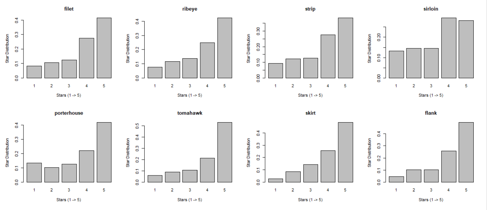
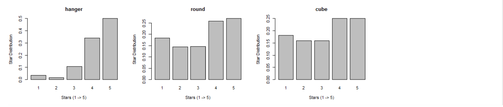
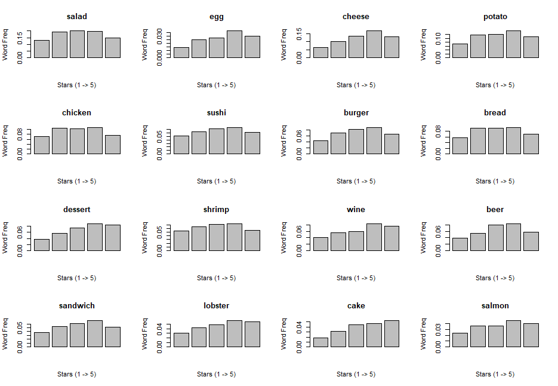

```{r setup, include=FALSE}
knitr::opts_chunk$set(echo = TRUE)
```

## 1.Goal

We would like to study the relationship of ratings, reviews and words in order to provide advice for opening a new steak restaurant and improving an existed steak restaurant from foods, non-food items by some histgrams and t-tests.  

## 2.Data Cleaning

Limited by the computing power, we chose to focus on restaurants whose category contained the word "steak". Then we used some tools in `nltk` to split, clean and recreate the reviews. 

The `yelp.ipynb` in `code` folder is used to clean the data and create the word frequency table and the large word embedding table with original views.

After filtering and combination, the `steak_cleaned.csv` has 33629 rows × 6085 columns.

## 3.Insights about Steak Restaurants

### 3.1 Different Types of Steak

Firstly, let's check the common types of steaks and how their ratings distribute. These steaks are also the ones that appear many times in the comments.

```{r echo=FALSE, out.width='80%'}

```
```{r echo=FALSE, out.width='80%'}

```

We found that tomahawk, skirt, hanger and flank steaks tends to obtain 5-star comments more easily. The portion of their 5-star comments is significantly over 45%.

However, customers seem to be more picky on sirloin, round and cube steak according to the data. The portion of their 5-star comments is roughly less than 30%.  

### 3.2 Different Types of other food

```{r echo=FALSE, out.width='85%'}

```

We found that egg, cheese, burger, shrimp are more frequently mentioned as the star goes up, especially from 1-star to 4-star. 

As for dessert and drink, cake is one of the desserts that customers may pay more attention to or have higher expectation and people tend to make more comments on wine and beer as the quality of restaurant increases.

### 3.3 Statistical Analysis on Business Atrributes

It's noticeable that the `business_city.json` contains many attributes of each restaurant. We decided to conduct t-test on some of the attributes to see whether different levels of some attributes can make a statistically significant difference on a restaurant's stars.

Firstly, let's check the overall star distributions of all steak restaurants.

```{r echo=FALSE, message=FALSE, warning=FALSE,out.width='50%',fig.align='center'}
####check overall steak stars
rm(list = ls())
library(dplyr)

data=read.csv('../data/attributes_data_for_ttest.csv')
data2=data %>% 
  group_by(restaurant,stars) %>% 
  summarise(n=n()) %>% 
  select(restaurant,stars)

hist(data2$stars,main = 'Steak Restaurant Stars Histgram',breaks=c(0:5),freq = F,xaxt = "n",xlab = 'Stars',ylab = 'Freq',ylim = c(0,0.6))
```

There are 7 attributes selected and the p-value of each t-test is as below.

```{r message=FALSE, warning=FALSE, include=FALSE}
####conduct t-test
p=c()

##RestaurantsReservations
data3=data %>% 
  filter(attribute=='RestaurantsReservations') %>% 
  filter(!level=='None')

table(data3$level)

t <- subset(data3, level == "True")
f <- subset(data3, level == "False")
var.test(t$stars, f$stars)
t.test(t$stars, f$stars, var.equal = FALSE,alternative = 'greater')
p=c(p,t.test(t$stars, f$stars, var.equal = FALSE,alternative = 'greater')$p.value)
#significant

##NoiseLevel
data3=data %>% 
  filter(attribute=='NoiseLevel') %>% 
  filter(!level=='None')

table(data3$level)

t <- subset(data3, grepl('quiet',level))
f <- subset(data3, !grepl('quiet',level))
var.test(t$stars, f$stars)
t.test(t$stars, f$stars, var.equal = TRUE,alternative = 'greater')
p=c(p,t.test(t$stars, f$stars, var.equal = TRUE,alternative = 'greater')$p.value)
#not significant


##RestaurantsAttire
data3=data %>% 
  filter(attribute=='RestaurantsAttire') %>% 
  filter(!level=='None')

table(data3$level)

t <- subset(data3, !grepl('casual',level))
f <- subset(data3, grepl('casual',level))
var.test(t$stars, f$stars)
t.test(t$stars, f$stars, var.equal = TRUE,alternative = 'greater')
p=c(p,t.test(t$stars, f$stars, var.equal = TRUE,alternative = 'greater')$p.value)
#significant 

##WiFi
data3=data %>% 
  filter(attribute=='WiFi') #%>% 
#  filter(!level=='None')

table(data3$level)

t <- subset(data3, grepl('free',level))
f <- subset(data3, !grepl('free',level))
var.test(t$stars, f$stars)
t.test(t$stars, f$stars, var.equal = TRUE,alternative = 'greater')
p=c(p,t.test(t$stars, f$stars, var.equal = TRUE,alternative = 'greater')$p.value)
#not significant

##OutdoorSeating
data3=data %>% 
  filter(attribute=='OutdoorSeating') #%>% 
  #  filter(!level=='None')
  
table(data3$level)

t <- subset(data3, grepl('True',level))
f <- subset(data3, !grepl('True',level))
var.test(t$stars, f$stars)
t.test(t$stars, f$stars, var.equal = TRUE,alternative = 'greater')
p=c(p,t.test(t$stars, f$stars, var.equal = TRUE,alternative = 'greater')$p.value)
#significant


##RestaurantsDelivery
data3=data %>% 
  filter(attribute=='RestaurantsDelivery') %>% 
  filter(!level=='None')

table(data3$level)

t <- subset(data3, grepl('True',level))
f <- subset(data3, !grepl('True',level))
var.test(t$stars, f$stars)
t.test(f$stars, t$stars, var.equal = TRUE,alternative = 'greater')
p=c(p,t.test(f$stars, t$stars, var.equal = TRUE,alternative = 'greater')$p.value)
# significant

##RestaurantsGoodForGroups
data3=data %>% 
  filter(attribute=='RestaurantsGoodForGroups') %>% 
  filter(!level=='None')

table(data3$level)

t <- subset(data3, grepl('True',level))
f <- subset(data3, !grepl('True',level))
var.test(t$stars, f$stars)
t.test(t$stars, f$stars, var.equal = TRUE,alternative = 'greater')
p=c(p,t.test(f$stars, t$stars, var.equal = TRUE,alternative = 'greater')$p.value)
#not significant
p=format(p, scientific = FALSE)
attribute=c("RestaurantsReservations","NoiseLevel","RestaurantsAttire","WiFi","OutdoorSeating","RestaurantsDelivery","RestaurantsGoodForGroups")
pvalue_ttest=data.frame(attribute,p.value=p)
```

```{r echo=FALSE, message=FALSE, warning=FALSE}
library(knitr)
#pvalue_ttest
kable(pvalue_ttest, format = "markdown")
```
With significance level of 0.05, the `RestaurantsReservations(True)` , `RestaurantsAttire(Dressy)`, `OutdoorSeating(True)` and `RestaurantsDelivery(False)` can statistically leads to significant higher stars. The `NoiseLevel(Quiet)`, `WiFi(Free)`, `RestaurantsGoodForGroups(True)` didn't statistically matter.

## 4.Actionable plan

### 4.1 Advice on opening a new steak restaurant

In the aspect of steaks:

- Focus on tomahawk, skirt, hanger and flank steaks at first and emphasize them on your menu.
- Filet, ribeye, strip and porterhouse steaks are not bad to consider.
- Make sirloin, round and cube steaks inconspicuous on your menu or avoid offering them. 

In the aspect of other foods:

- Set a more varied range of wines and beers offered at your restaurant
- Make sure the egg and cheese served at your restaurant taste great
- Consider hiring patissiers and serve desserts 
- Salad is important

In the aspect of non-food items:

- Set up a proper reservation system is important.
- Offer well-designed attire to your waiters/waitresses.
- Look for possible locations with outdoor seating.
- Don't provide food delivery service.
- Avoid investing in WiFi or soundproof materials at the beginning.
- Allocating too much spaces for groups specially is unnecessary.

### 4.2 Advice on improving an existed steak restaurant

In the aspect of steaks:

- Try to improve tomahawk, skirt, hanger and flank steaks if one of them has brought your restaurant many low-star comments since the customers are not so picky about them.
- Advertise your sirloin, round and cube steaks if one of them has brought your restaurant high-star comments. It is very praiseworthy to have highly rated sirloin, round and cube steaks.

In the aspect of other foods:

- Improve the quality of wines and beers 
- Cheese and salad are always focus points
- Start serving desserts may help

In the aspect of non-food items:

- Improve or set up  your reservation system.
- Pay attention to the attire of your waiters/waitresses.
- Check if it's possible to offer outdoor seating.
- Don't provide food delivery service.
- Allocating too much spaces for groups specially is unnecessary.

## 5.Shiny App

link

## 6.Contribution

HK contributed to the coding and writing of summary outline and the food and t-test part.

ZW contributed to the coding and writing of non-food part and the slides of presentation. 

PR contributed to the coding and writing of the shiny app and the slides of presentation.


