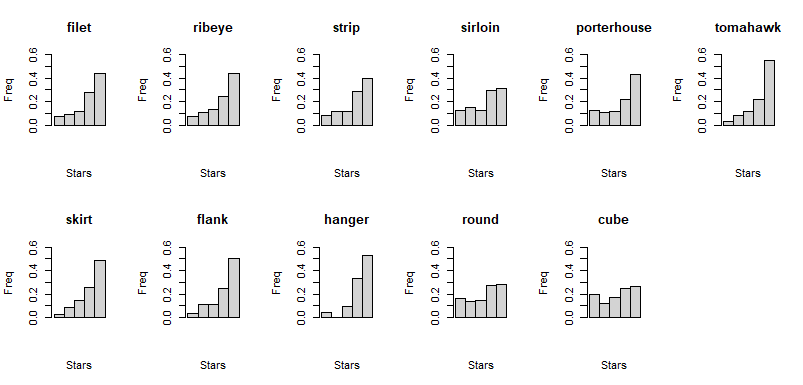

```{r setup, include=FALSE}
knitr::opts_chunk$set(echo = TRUE)
```

## 1.Goal

To provide

- Data-driven actionable plan to help business owners improve their ratings on Yelp. 

- Key useful, analytical insights from the data (e.g. plots, tables, models, inferential methods, etc.) .
- A demonstration of your Shiny application.

## 2.Data Cleaning

Limited by the computing power, we chose to focus on restaurants whose category contained the word "steak".

The `yelp.ipynb` in `code` folder is used to clean the data and create the word frequency table and the large word embedding table with original views.

After filtering and combination, the `steak_cleaned.csv` has 33629 rows × 6085 columns.

## 3.Insights about Steak Restaurants

### 3.1 Different Types of Steak

Firstly, let's check the common types of steaks and how their ratings distribute. These steaks are also the ones that appear many times in the comments.

```{r echo=FALSE, out.width='95%'}

```


We found that tomahawk, skirt, hanger and flank steaks tends to obtain 5-star comments more easily. The portion of their 5-star comments is significantly over 45%.

However, customers seem to be more picky on sirloin, round and cube steak according to the data. The portion of their 5-star comments is roughly less than 30%.  

### 3.2 Different Types of other food

todo

### 3.3 Different Non-food Items

todo

food, drink, wifi, parking, price...

####################
words distribution in reviews of different stars

focus on certain district like Madison

compare great and awful restaurant from words of food type,  etc

statistical test?

...

## 4.Actionable plan

### 4.1 Advice on opening a new steak restaurant

In the aspect of steaks:

- Focus on tomahawk, skirt, hanger and flank steaks at first and emphasize them on your menu.

- Filet, ribeye, strip and porterhouse steaks are not bad to consider.

- Make sirloin, round and cube steaks inconspicuous on your menu or avoid offering them. 


In the aspect of other foods:

In the aspect of non-food items:

### 4.2 Advice on improving an existed steak restaurant

In the aspect of steaks:

- Try to improve tomahawk, skirt, hanger and flank steaks if one of them has brought your restaurant many low-star comments since the customers are not so picky about them.

- Advertise your sirloin, round and cube steaks if one of them has brought your restaurant high-star comments. It is very praiseworthy to have highly rated sirloin, round and cube steaks.

In the aspect of other foods:

In the aspect of non-food items:

## 5.Shiny App

link


